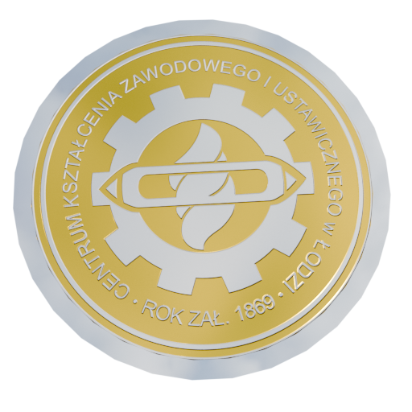

# Project Ricochet

Edukacyjna gra strzelniczo-logiczna zbudowana na silniku Godot Engine 4.6.1. Projekt stworzony dla konkursu CKZiU "School Games 2026" przez uczniów klasy 4TP (Programista) w 2025-2026 roku. Gra promocyjna dla Centrum Kształcenia Zawodowego i Ustawicznego w Łodzi, opublikowana jako open source do celów edukacyjnych.

**Autorzy**: Tymon Woźniak, Olga Orłowska

## O grze

Project Ricochet to gra, gdzie gracz wcielając się w kulę, musi celować i strzelać, aby poruszać się po poziomach szkoły CKZiU. Główne elementy:

- **Mechanika celowania**: Kliknij gracza, przeciągnij myszę - system pokazuje trajektorię lotu z odbiciami od ścian
- **Boost z kawy**: Zbierz kawę z automatu (wyzwalana po uderzeniu) - zwiększa siłę strzału o 50%
- **Monety szkolne**: Zbieraj CezCoiny (monety szkolne) + zdjęcia z eventów CKZiU
- **3 poziomy gry**: Tutorial (bez presji czasu), Level 1 (timer od pierwszego strzału), Level 2 (pełny timer 3 minuty)
- **Hazardy**: Specjalne strefy śmiertelne wymagające precyzji

## Wymagania systemowe

### Godot Engine
- Wersja 4.6.1 (lub nowsza, zgodna z 4.6.x)
- Silnik OpenGL Compatibility (domyślnie zainstalowany)

### Urządzenia
- System operacyjny: Windows 10+, Linux (Ubuntu, Fedora i inne), przeglądarki WebGL2
- Pamięć RAM: minimum 512 MB
- Miejsce na dysku: ok. 200 MB
- Procesor: x64 (Windows, Linux) lub WebGL2 (HTML5)

## Szybki start

### Klonowanie projektu

```bash
git clone https://github.com/Moderrek/project-ricochet.git
cd project-ricochet
```

### Otwarcie w Godot Engine

1. Pobierz Godot 4.6.1 z https://godotengine.org/download
2. Otwórz Godot Engine
3. Kliknij "Open Project"
4. Wskaż folder `project-ricochet` (ten, który przed chwilą sklonowałeś)
5. Godot załaduje projekt automatycznie

### Uruchomienie

Naciśnij `F5` w edytorze lub kliknij przycisk Play (w górnym rogu). Gra uruchomi się w oknie.

## Eksport do różnych platform

Gra pracuje identycznie na Windows, Linux i w przeglądarce. Aby stworzyć wersję do uruchomienia bez Godot Editor:

### Windows (plik .exe)

1. Przejdź do Project → Export
2. Dodaj nowy preset "Windows Desktop"
3. Ustaw folder docelowy (np. `export/windows`)
4. Kliknij Export Project
5. Gotowy plik .exe pojawi się w wybranym folderze - dwuklik uruchamia grę

### Linux (plik binarny)

1. Przejdź do Project → Export
2. Dodaj nowy preset "Linux/X11"
3. Ustaw folder docelowy (np. `export/linux`)
4. Kliknij Export Project

Uruchomienie z terminala:
```bash
chmod +x ./project-ricochet
./project-ricochet
```

### HTML5 (w przeglądarce - WebGL2)

1. Przejdź do Project → Export
2. Dodaj nowy preset "Web"
3. Ustaw folder docelowy (np. `export/web`)
4. Kliknij Export Project

Uruchomienie lokalnie:
```bash
cd export/web
python -m http.server 8000
```

Otwórz http://localhost:8000 w przeglądarce Firefox lub Chrome.

## Struktura projektu

```
project-ricochet/
├── autoloads/            - Singletony (globalne obiekty ładujące się na start)
│   ├── game_manager.gd   - Zarządza czasem, poziomami, statystykami gry
│   ├── scene_changer.gd  - Przejścia między scenami (fade in/out)
│   ├── save_manager.gd   - Zapis postępu gracza
│   ├── photo_manager.gd  - Zarządzanie galeriami zdjęć
│   └── network_manager.gd- Komunikacja z API (news, dane zdalnie)
│
├── scenes/               - Sceny gry
│   ├── levels/           - Poziomy: tutorial, level 1, level 2
│   ├── entities/         - Gracz (ball physics)
│   ├── interactables/    - Obiekty interaktywne (drzwi, automat do kawy, palety)
│   ├── collectibles/     - Przedmioty do zbierania (monety, boost, zdjęcia)
│   ├── menus/            - Menu główne, ekran końcowy
│   └── ui/               - Interfejs użytkownika (HUD, timery, liczniki)
│
├── resources/            - Konfiguracje Godot
│   ├── data/             - Skrypty danych (poziomy, skinki, zdjęcia)
│   ├── levels/           - Dane poziomów (.tres)
│   ├── photos/           - Galerię zdjęć szkolnych
│   └── themes/           - Motywy interfejsu
│
├── assets/               - Grafiki i dźwięki
│   ├── images/           - Sprite sheets, ikony, grafiki
│   ├── sounds/           - Efekty dźwiękowe, muzyka
│   ├── fonts/            - Czcionki TTF
│   ├── icons/            - Ikony interfejsu
│   └── photos/           - Zdjęcia z eventów szkolnych
│
├── shaders/              - Specjalne efekty wizualne
├── project.godot         - Konfiguracja projektu Godot
└── README.md            - Ten plik
```

## Jak działa gra

### Podstawowa rozgrywka

1. **Celowanie**: Kliknij na gracza, przeciągnij myszę - zobaczysz linię pokazującą gdzie poleci
2. **Strzał**: Puść przycisk myszy - gracz leci w tym kierunku
3. **Odbicia**: Gracz odbija się od ścian (maksymalnie 2 razy, zanim straci energię)
4. **Boost**: Zbierz kawę z automatu - następny strzał będzie 1.5x silniejszy
5. **Zbieranie**: Dotknij monet (CezCoiny) i zdjęć - liczą się do wyniku
6. **Hazardy**: Omijaj niebezpieczne strefy - jeśli gracz je dotknie, respawnuje po 1.2 sekundy
7. **Koniec**: Dotknij bramki na końcu poziomu - przechodzisz do następnego

### Zmienne w grze

- **Timer**: 3 minuty (180 sekund) - z wyjątkiem tutoriala (bez timera)
  - W Level 1: timer zaczyna się po pierwszym strzale
  - W Level 2+: timer od razu
- **Boost**: +50% siły na jeden strzał, wyczerpuje się co sekundę podczas gry
- **Statystyki**: Gra liczy wszystkie strzały, odbicia i śmierci

## Architektura kodu

Projekt jest napisany czystym kodem:

- **Singletony (autoloads)**: Globalne obiekty - GameManager, SceneChanger, SaveManager - załadowują się raz na start
- **Sceny modułowe**: Każdy poziom, drzwi, przedmiot - to osobna scena, którą można edytować niezależnie
- **Komunikacja przez sygnały**: Komponenty informują się nawzajem o wydarzeniach (np. gracz zbierz monetę → HUD się aktualizuje), zamiast sprawdzać co klatkę
- **Fizyka Godot**: RigidBody2D dla gracza, StaticBody2D dla terenu, Area2D dla collectibles

To pozwala grze działać sprawnie nawet na starszym sprzęcie szkolnym.

## Obsługiwane platformy

Gra działa identycznie na wszystkich platformach - kod jest napisany tak, żeby działać wszędzie.

| Platforma | Status | Format | Uwagi |
|-----------|--------|--------|-------|
| Windows 11 | Testowana | .exe | Domyślna platforma do testów |
| Ubuntu 22.04+ | Testowana | ELF binary | Pracuje gładko |
| Fedora | Testowana | ELF binary | Pracuje gładko |
| Chrome (HTML5) | Testowana | WebAssembly | Brak instalacji, otwiera się w przeglądarce |
| Firefox (HTML5) | Testowana | WebAssembly | Brak instalacji, otwiera się w przeglądarce |

## Zalety projektu

### Dla uczniów i nauczycieli informatyki

- **Projekt do nauki**: Wzorowy przykład, jak zbudować grę od zera
- **Czysty kod**: Każda funkcja ma jasny cel, łatwo się czyta
- **Dokumentacja**: Pliki README.md w każdym folderze wyjaśniają strukturę
- **Open source**: Możesz modyfikować, dodawać własne poziomy i obiekty

### Dla szkoły CKZiU

- **Promocja**: Gra pokazuje możliwości szkoły - fizykę, logikę, grafiki
- **Edukacyjna**: Uczy precyzji, planowania i myślenia w 2D
- **Konkurs**: Tworzona na konkurs "School Games 2026" z zamiarem zostania na edukację

### Dla programistów

- Przykład dobrej organizacji projektu w Godot
- System singletów i scen modułowych
- Komunikacja między komponentami przez sygnały
- Zapis gry w JSON-ie
- Zarządzanie zasobami (grafiki, dźwięki, dane)

## Licencja

Projekt opublikowany na licencji MIT. Oznacza to, że możesz go używać, modyfikować i rozpowszechniać swobodnie. Detale w pliku [LICENSE](LICENSE).

## Dla szkoły i edukacji

Projekt pochodzi z konkursu **CKZiU "School Games 2026"** i został upubliczniony jako open source. Celem jest:

- Promowanie szkoły CKZiU w Łodzi
- Pokazanie uczniom, jak buduje się gry
- Materiał edukacyjny dla nauczycieli informatyki
- Inspiracja dla przyszłych projektów szkolnych

## Kontakt i informacje

- **Godot Engine**: https://godotengine.org
- **Dokumentacja Godot 4**: https://docs.godotengine.org
- **GDScript**: https://docs.godotengine.org/en/stable/getting_started/scripting/gdscript/index.html

Każdy podfolder w projekcie zawiera plik README.md z dodatkowymi informacjami o organizacji. Sprawdź je jeśli chcesz zrozumieć szczegóły konkretnej części gry.
