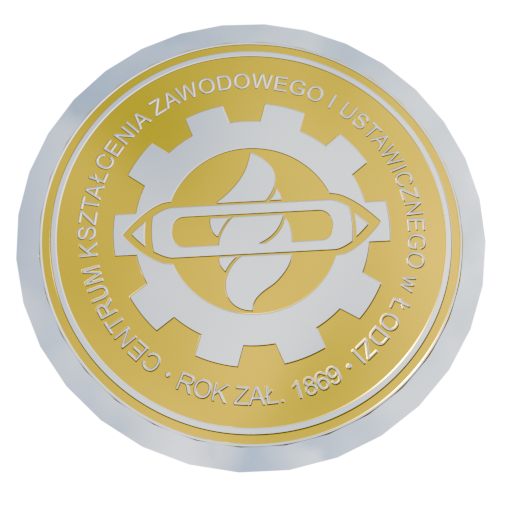
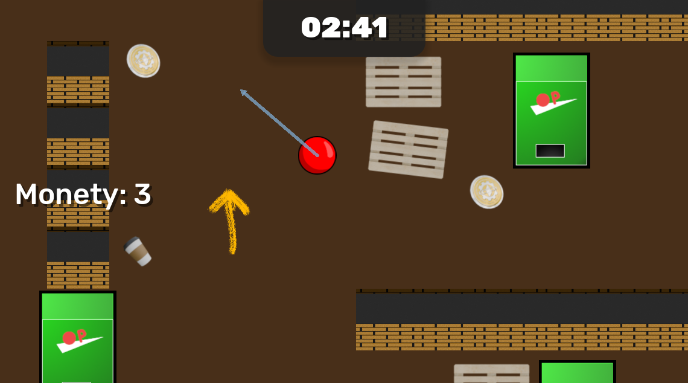
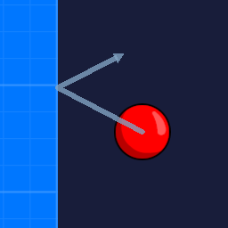
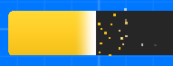
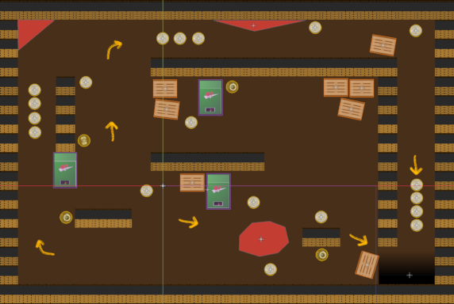
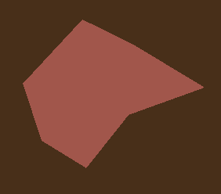

<div align="center">
    
    <h1>CKZiU: 3 Minuty do Dzwonka</h1>
    <p>
        
        
        
    </p>
</div>


Edukacyjna gra strzelniczo-logiczna oparta na silniku [Godot](https://godotengine.org/).



Projekt stworzony na konkurs [CKZiU "School Games 2026"](https://cez.lodz.pl/2026/03/25/konkurs-school-games-2026/) przez dwóch uczniów klasy 4TP (Programista) w roku szkolnym 2025-2026. Stworzenie tej gry zajeło trochę ponad miesiąc.

Gra promocyjna dla Centrum Kształcenia Zawodowego i Ustawicznego w Łodzi, opublikowana jako open source do celów edukacyjnych.

**Autorzy**: Tymon Woźniak, Olga Orłowska

## O grze

**CKZiU: 3 Minuty do Dzwonka** to gra, gdzie gracz wcielając się w kulę, musi celować i strzelać, aby poruszać się po poziomach szkoły CKZiU.

Główne elementy:
- **Mechanika celowania**: Kliknij gracza, przeciągnij mysz - system pokazuje trajektorię lotu z odbiciami od ścian  
  
- **Wzmocnienie kawy**: Zbierz kawę z automatu - zwiększa siłę strzału o 50%  
  
- **Monety szkolne**: Zbieraj Cez Coiny (monety szkolne)  
  
- **3 poziomy gry**: Tutorial (bez presji czasu), Level 1 (minutnik od pierwszego strzału), Level 2 (kontynuacja minutnika)  
  
- **Strefy zagrożenia**: Specjalne strefy śmiertelne wymagające precyzji  
  

## Jak zagrać?

Aby zagrać możesz przejść na stronę [cezgame.cloud](https://cezgame.cloud) albo pobrać plik wykonywalny dla twojej platformy w [Github Releases](https://github.com/Moderrek/project-ricochet/releases).

> [!NOTE]
>
> Niestety Ogólnopolska Sieć Edukacyjna (OSE), która m.in dostarcza internet CKZiU w Łodzi
> z powodów "Ochrony przed szkodliwym oprogramowaniem" blokuje domenę "cezgame.cloud" z powodu
> zawierania słowa game

## Wymagania systemowe

- **Silnik**: Godot Engine 4.6.1 lub nowszy
- **System**: Windows 10/11, dowolna dystrybucja Linux (z obsługą OpenGL), lub przeglądarka (z obsługą WebGL2)

## Szybki start

### Klonowanie projektu

```bash
git clone https://github.com/Moderrek/project-ricochet.git
cd project-ricochet
```

### Otwarcie w Godot Engine

1. Pobierz [Godot 4.6.1](https://godotengine.org/download)
2. Otwórz Godot
3. Kliknij "Open Project"
4. Wskaż folder `project-ricochet` (ten, który przed chwilą został sklonowany)
5. Godot załaduje projekt automatycznie

### Uruchomienie

Naciśnij `F5` w edytorze lub kliknij przycisk Play (w górnym rogu). Gra uruchomi się w oknie.

## Build: Eksport do różnych platform

Gra pracuje identycznie na Windows, Linux i w przeglądarce.
Aby stworzyć wersję do uruchomienia bez Godot Editor:

### Windows (plik wykonywalny)

1. Przejdź do Project → Export
2. Dodaj nowy preset "Windows Desktop"
3. Ustaw folder docelowy (np. `export/windows`)
4. Kliknij Export Project
5. Gotowy plik z końcówką `.exe` pojawi się w wybranym folderze - dwuklik uruchamia grę

### Linux (plik wykonywalny)

1. Przejdź do Project → Export
2. Dodaj nowy preset "Linux/X11"
3. Ustaw folder docelowy (np. `export/linux`)
4. Kliknij Export Project

Uruchomienie z terminala:
```bash
chmod +x ./project-ricochet
./project-ricochet
```

### HTML5 (w przeglądarce - WebGL2)

1. Przejdź do Project → Export
2. Dodaj nowy preset "Web"
3. Ustaw folder docelowy (np. `export/web`)
4. Kliknij Export Project

Uruchomienie lokalnie:
```bash
cd export/web
python -m http.server 8000
```

Otwórz http://localhost:8000 w przeglądarce Firefox lub Chrome.

## Jak działa gra

### Podstawowa rozgrywka

1. **Celowanie**: Kliknij na gracza, przeciągnij myszę to zobaczysz linię pokazującą gdzie poleci.
2. **Strzał**: Puść przycisk myszy. Gracz poleci w tym kierunku.
3. **Odbicia**: Gracz odbija się od ścian.
4. **Wzmocnienie**: Jeśli zbierzesz kawę z automatu to twój następny strzał będzie 1.5x silniejszy.
5. **Zbieranie**: Zbieraj znajdźki podczas rozgrywki. Zbieraj monety oraz zdjęcia!
6. **Strefy zagrożenia**: Omijaj niebezpieczne strefy. Jeśli gracz je dotknie, wraca na początek.
7. **Koniec**: Po dotknięciu bramki na końcu poziomu przechodzisz do następnego.

## Architektura kodu

Projekt jest napisany czystym kodem:

- **Singletony (autoloads)**: Globalne obiekty takie jak `GameManager`, `SceneChanger`, `SaveManager` załadowują się raz na start.
- **Sceny modułowe**: Każdy poziom, drzwi, przedmiot to osobna scena, którą można edytować niezależnie.
- **Komunikacja przez sygnały**: Komponenty informują się nawzajem o wydarzeniach za pomocą [sygnałów](https://docs.godotengine.org/en/stable/getting_started/step_by_step/signals.html) (wbudowane w silnik Godot) (np. gracz zbiera monete → HUD się aktualizuje), zamiast sprawdzać co klatkę.

To pozwala grze działać sprawnie nawet na starszym sprzęcie szkolnym.

## Obsługiwane platformy

Gra działa identycznie na wszystkich platformach.  
Kod jest napisany tak, żeby działać wszędzie.

| Platforma | Status | Format | Uwagi |
|-----------|--------|--------|-------|
| Windows 11 | Testowana | PE binary | Domyślna platforma do testów |
| Ubuntu 22.04+ | Testowana | ELF binary | Pracuje gładko |
| Fedora | Testowana | ELF binary | Pracuje gładko |
| Chrome (HTML5) | Testowana | WebAssembly | Brak instalacji, otwiera się w przeglądarce |
| Firefox (HTML5) | Testowana | WebAssembly | Brak instalacji, otwiera się w przeglądarce |

## Zalety projektu

### Dla uczniów i nauczycieli informatyki

- **Projekt do nauki**: Wzorowy przykład, jak zbudować grę od zera.
- **Czysty kod**: Każda funkcja ma jasny cel, łatwo się czyta.
- **Dokumentacja**: Pliki README.md w każdym folderze wyjaśniają strukturę.
- **Open Source**: Możesz modyfikować, dodawać własne poziomy i obiekty.

### Dla szkoły CKZiU

- **Promocja**: Gra pokazuje możliwości szkoły. Fizykę, logikę, grafiki.
- **Edukacyjna**: Uczy precyzji, planowania i myślenia w 2D
- **Konkurs**: Tworzona na konkurs "School Games 2026".

### Dla programistów

- Przykład dobrej organizacji projektu w Godot
- System singletów i scen modułowych
- Komunikacja między komponentami przez sygnały
- Zarządzanie zasobami (grafiki, dźwięki, dane)

## Licencja

Projekt opublikowany na licencji MIT.  
Oznacza to, że możesz go używać, modyfikować i rozpowszechniać swobodnie.  
Detale w pliku [LICENSE](./LICENSE).

## Dla szkoły i edukacji

Projekt pochodzi z konkursu **CKZiU "School Games 2026"** i został upubliczniony jako Open Source. Celem jest:

- Promowanie szkoły CKZiU w Łodzi
- Pokazanie uczniom, jak buduje się gry
- Materiał edukacyjny dla nauczycieli informatyki
- Inspiracja dla przyszłych projektów szkolnych

## Wkład w projekt

Chcesz dodać nowy poziom lub naprawić błąd?

1. Sforkuj repozytorium.
2. Stwórz nową gałąż opisującą twoje zmiany (np. `git checkout -b feature/nowy-poziom`).
3. Zacommituj zmiany.
4. Otwórz Pull Request.

## Kontakt i informacje

[Tymon Woźniak](https://github.com/Moderrek) email: <tymon.student@gmail.com>

- **Godot Engine**: https://godotengine.org
- **Dokumentacja Godot 4**: https://docs.godotengine.org
- **GDScript**: https://docs.godotengine.org/en/stable/getting_started/scripting/gdscript/index.html

Każdy podfolder w projekcie zawiera plik `README.md` z dodatkowymi informacjami o organizacji.  
Sprawdź je jeśli chcesz zrozumieć szczegóły konkretnej części gry.
