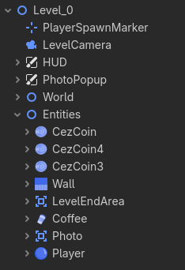

# Assets (Zasoby)

Wszystkie surowe pliki graficzne, dźwiękowe i czcionki.
Tutaj przechowywane są przed zintegrowaniem z grą w scenach Godot.

> [!IMPORTANT]
>
> Pliki `.import` to metadane Godot. Nie edytuj ich ręcznie.

---

## Czcionki (fonts/)

Czcionki w formacie TTF ([TrueType Font](https://en.wikipedia.org/wiki/TrueType)) używane w interfejsie.

### Dostępne czcionki

- **Rubik-Regular.ttf** - Zwykły tekst (menu, HUD, dialogów)
- **Rubik-Medium.ttf** - Średnia waga (nagłówki)
- **Rubik-Black.ttf** - Pogrubiona (ważne teksty, tytuły)

### Gdzie są używane

- Menu główne: Rubik-Medium (przyciski), Rubik-Black (tytuł)
- HUD (w grze): Rubik-Regular (timer, licznik monet)
- Ekran końcowy: Rubik-Black (CEL OSIĄGNIĘTY / SPÓŹNIENIE)

### Dodanie nowej czcionki

1. Skopiuj plik `*.ttf` do `fonts/`
2. W edytorze Godot: Control node → Theme → Font Family → wybiórz czcionkę
3. Godot automatycznie wygeneruje `*.import`

---

## Ikony (icons/)

Małe grafiki 64x64px na ikonki do Inspector'a w edytorze Godot *(nie widoczne dla gracza)*.

Dodanie ikon do swoich skryptów zwiększa czytelność scen.



Ikonki użyte w projekcie zostały zabarwione na kolor `#6393FF` (Godot Blue) oraz przeskalowane za pomocą GIMP z interpolacją NoHalo do rozdzielczości 64px x 64px.

### Użycie w skryptach

Aby dany węzeł był wyświetlany z ikoną musimy dołączyć do niego skrypt,
który będzie miał zdefiniowaną adnotację `@icon` jak poniżej.

Przykład:
```gdscript
@icon("res://assets/icons/player_icon.png")
extends RigidBody2D
class_name Player
```

Gdy otworzysz scenę w edytorze, ikona pojawia się obok nazwy klasy.

---

## Obrazki (images/)

Obrazki to Sprite, Sprite Sheets, elementy interfejsu oraz inne grafiki do gry, które widzi gracz.

---

## Dźwięki (sounds/)

Efekty dźwiękowe (SFX) i soundtrack gry w formacie OGG (Vorbis - kompresja).

### Efekty dźwiękowe (SFX)

```
sfx_coin.ogg           - Zbieranie monety (ding!)
sfx_gulp.ogg           - Zbieranie kawy (gulp)
sfx_shoot.ogg          - Strzał gracza (pow!)
sfx_hit.ogg            - Uderzenie w ścianę (bum!)
sfx_break.ogg          - Rozbicie/śmierć (crash!)
sfx_photo.ogg          - Foto collectible (snap!)
sfx_ui_click.ogg       - Klik przycisku (menu)
sfx_ui_hover.ogg       - Hover przycisku (menu)
ambient_machine_noise.ogg - Hałas automatu (tło)
```

### Soundtrack

- **soundtrack.ogg** - Główna muzyka gry (pętla)

Gra podczas całej rozgrywki, zatrzymuje się na ekranach menu.

### Dodanie nowego dźwięku

1. Konwertuj do OGG (Audacity: File → Export → OGG Vorbis)
2. Skopiuj do `sounds/`
3. W scenach: AudioStreamPlayer2D → Stream → Wybierz plik
4. Godot wygeneruje `*.import`

---

## Zdjęcia (photos/)

Zdjęcia z eventów szkolnych CKZiU - używane w PhotoManager.

### Zdjęcia w bazie

```
boze_narodzenie.jpg         - Świąteczny stół wigilijny
dyrektorzy.jpg              - Dyrektorowie szkoły
school_game.jpg             - Konkurs School Games 2026
walentyna_tierieszkowa.jpg  - Patronka szkoły (kosmonautka)
druk.jpg                    - Druk/publikacja szkoły
sztafeta_erasmus.jpg        - Międzyszkolna Sztafeta Erasmus
```

### Jak działają

W `resources/photos/photo_database.tres` - każde zdjęcie ma:
- ID (nazwa bez .jpg)
- Title (tytuł)
- Description (opis)
- Texture (ścieżka do PNG/JPG)

Gracz je zbiera w grze → PhotoManager odblokowuje → pojawia się w galerii.

### Dodanie nowego zdjęcia

1. Skopiuj JPG/PNG do `photos/`
2. Otwórz `resources/photos/photo_database.gd`
3. Dodaj nowe PhotoData:
   ```gdscript
   var photo_new = PhotoData.new()
   photo_new.id = "new_photo"
   photo_new.title = "Tytuł Zdjęcia"
   photo_new.description = "Opis..."
   photo_new.texture = load("res://assets/photos/new_photo.jpg")
   ```
4. Dodaj do bazy
5. Testuj: Photo collectible będzie je losować

---

## Format plików - dlaczego OGG a nie MP3?

- **OGG**: Bezpłatny, otwarty format (Godot preferuje)
- **MP3**: Patenty, droższe (nie używamy)
- **WAV**: Duże pliki (nie dla gier)

Godot konwertuje automatycznie do formatu skompresowanego przy eksporcie.

---

## Struktura folderów

```
assets/
├── fonts/          - Czcionki TTF (Rubik)
├── icons/          - Ikony edytora (dla programistów)
├── images/         - Sprites i grafiki (gracz je widzi)
├── photos/         - Zdjęcia z eventów szkoły
└── sounds/         - Efekty dźwiękowe i soundtrack
```

---

## Tips

- **Zawsze konwertuj dźwięki do OGG** - mniejsze pliki, lepsze dla web
- **PNG dla sprite'ów** - przezroczystość
- **JPG dla zdjęć** - mniejsze pliki na dysku
- **Sprite sheets** zamiast pojedynczych PNGów dla animacji
- Godot `.import` pliki - **nie edytuj ręcznie**, usuń jeśli coś się psuje
- Grafiki dla web: **optymalizuj rozmiary** - mniejsze download
